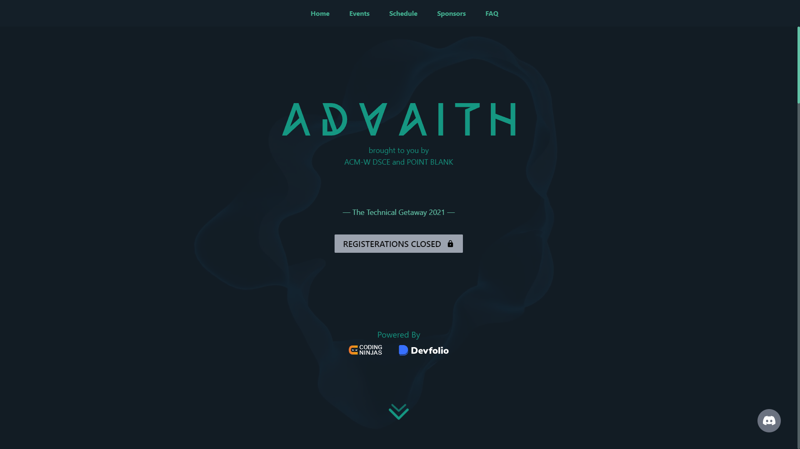
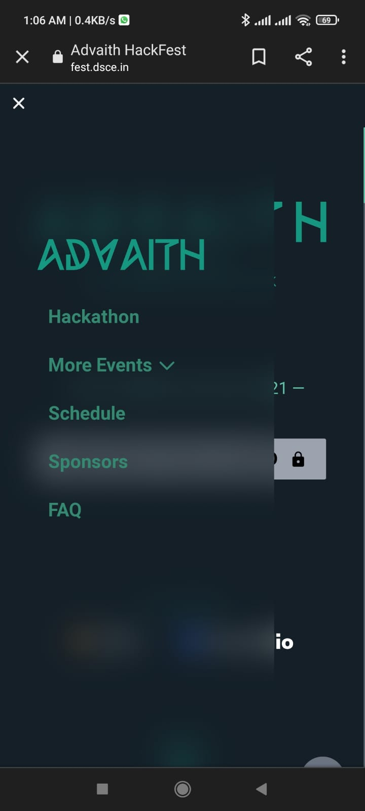

# ADVAITH

[]()

Official repository for Advaith.
Advaith is a Tech Fest run by Point Blank. Our goal is to provide an environment for students to network, learn, develop, and create awesome stuff. Advaith is an opportunity for students around the country to showcase their technical skills and get them validated by their peers and experts from the industry.

## Sections

* Home
    * Registrations
* About Us!
* Events
    * Capture Flag
    * Design Wars
    * Coding Marathon
    * Technical Writing
* Sponsors
* FAQs

## Requirements

* Node JS :
If Node JS is not installed in your PC, do check out the link provided below:
(https://nodejs.org/en/download/)

## TechStacks

* Next JS
* Tailwind CSS


## Features

* A Node.js development framework called Next Js is used to build this web solution. Next Js simplifies the process of server-side rendering and provides numerous other useful features, such as built-in CSS support, fast refresh, image optimization,dynamic routing, etc.
* Tailwind CSS was used for CSS styling because it enables complex responsive layouts to be built freely, has common utility patterns and creates small utilities with defined options that enable easy integration of existing classes directly into HTML code. Custom styling can be provided to the components with the help of this framework.
* The website was designed to be responsive, which automatically adjusts to different screen resolutions and viewports.
* For the purposes of tracking engagements, the website was connected to Google Analytics.

## Screenshots

 
 
  

## How to use

Execute [`create-next-app`](https://github.com/vercel/next.js/tree/canary/packages/create-next-app) with [npm](https://docs.npmjs.com/cli/init) or [Yarn](https://yarnpkg.com/lang/en/docs/cli/create/) to bootstrap the example:

```bash
npx create-next-app --example with-tailwindcss with-tailwindcss-app
# or
yarn create next-app --example with-tailwindcss with-tailwindcss-app
```

Deploy it to the cloud with [Vercel](https://vercel.com/new?utm_source=github&utm_medium=readme&utm_campaign=next-example) ([Documentation](https://nextjs.org/docs/deployment)).

## To Contribute

* Create an issue
* Get it assigned
* Pull the latest code and start working after it is assigned
* Create a pull request and mention the issue number with '#'
